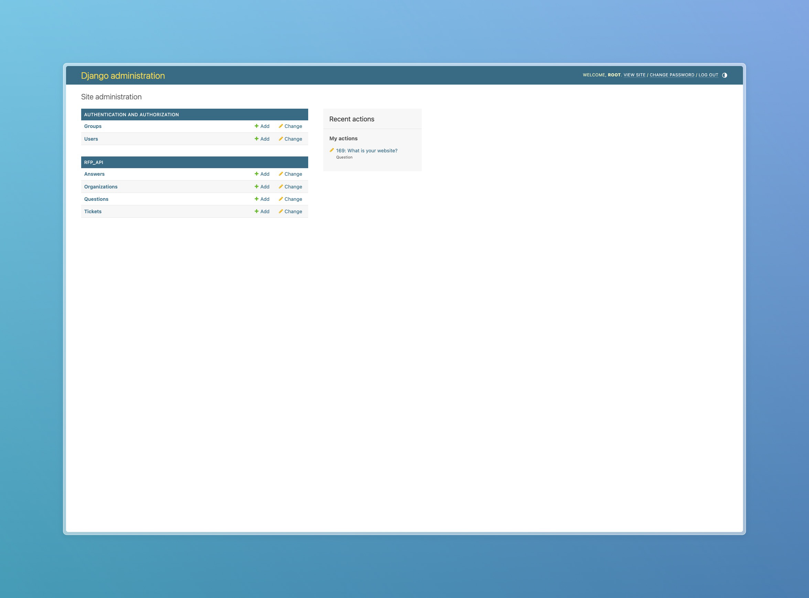

# Partner Personnel Chatbot Documentation

## Table of Contents
- [Partner Personnel Chatbot Documentation](#partner-personnel-chatbot-documentation)
    - [Table of Contents](#table-of-contents)
    - [Introduction](#introduction)
    - [Problem](#problem)
    - [Data Definition (EDA)](#data-definition-eda)
        - [Data Structure](#data-structure)
        - [Data Analysis](#data-analysis)
            - [Histogram Analysis](#histogram-analysis)
            - [Bertopic Analysis](#bertopic-analysis)
            - [Word Frequency Analysis](#word-frequency-analysis)
            - [Similar Questions Analysis](#similar-questions-analysis)
            - [Hierarchical clustering Analysis](#hierarchical-clustering-analysis)
    - [Model](#model)
        - [SBERT model](#sbert-model)
        - [Vector Database](#vector-database)
    - [Installation Guide](#installation-guide)
        - [Setting up the Server](#setting-up-the-server)
            - [Visual Studio](#visual-studio)
            - [WSL2 (Windows Subsystem for Linux)](#wsl2-windows-subsystem-for-linux)
    - [Admin Guide](#admin-guide)
        - [About the Admin Interface](#about-the-admin-interface)
        - [Helper Pages](#helper-pages)
        - [Database Schema Readout](#database-schema-readout)

## Introduction
Requests for Proposals (RFPs) can come in many different formats, but typically include a variety of questions. Different RFPs can have common questions. We have been tasked with building a model similar to a chat bot that can identify questions from RFPs and correctly answer them in accordance with both company guidelines and values.


## Problem
RFPs come from in a variety of formats but often ask similar questions that require consistent and well-informed responses. Current manual methods for handling these questions are resource intensive and prone to variations in responses from one employee to another. Our task is to create a model that could automatically recognize and respond to RFP questions. This would not only address the time-consuming nature of the process but also ensure standardization of responses.


## Data Definition (EDA)
### Data Structure
Our data is mainly text that is provided for question and answer matching. Thus, our set of data is unstructured and unsupervised. Since our data lacks specific structure or format, it requires advanced techniques like natural language processing(NLP) and machine learning for analysis.


### Data Analysis
For our analysis, we mainly focused on clustering our data as it is effective for grouping unlabeled text based on their similarities or differences.


#### Histogram Analysis
Histogram analysis helped us find outlier data that needed to be preprocessed. These outliers include multiple questions bundled in a single question or giving multiple contexts for a description that is not even a question. The figures below are histograms for word counts and character counts of 168 given questions.

 


Many of the RFPs will contain questions with multiple topics or multiple questions combined to form a single question. To filter through 'bundled questions', we will preprocess it by looking for questions that contain more than one question mark. 
The figure below is the histogram for the number of question marks for each question.


#### Bertopic Analysis
We used HDBSCAN in Bertopic to get reasonable topic clusters. Since we have a small data size of 168 questions, we reduced the number of `min_cluster_size` parameters in the HDBSCAN function to create more topic clusters.


#### Word Frequency Analysis
We performed frequency distribution for the top 50 words to see that 'please', 'security', and 'Segra' to be the top 3 words. This analysis has shown that we should preprocess words that are similar to 'please' as these are adverbs that are not important to the main context of the questions. We should also preprocess entity names such as 'Segra' as we want our solution to be more dynamic and generalized.

 


#### Similar Questions Analysis
The aim of this project is to create an application capable of taking in text, creating an embedding of the text, and then finding out what cluster it fits into in order to serve an answer back to the user. To see how similar these questions were, We used sentence transformers for more useful embedding capable of differentiating and clustering questions. 1.0 in the figure below represents the diagonal line of the same questions. This graph indicates that most of the questions are not similar to each other.


#### Hierarchical clustering Analysis
To see how topics are clustered, we have performed agglomerative (bottom-up) hierarchical clusters. As a result of this analysis, we saw that topics that have been generated are meaningful, and had successful clustering of similar topics.


## Model
K-Nearest Neighbor(KNN) Using a Vector Database Algorithm


### SBERT model
SBERT or Sentence-BERT is an updated version of BERT that better understands sentence meanings. SBERT uses special structures called siamese and triplet networks to compare sentences. For example, if we have five sentences or in our case questions and answers, SBERT can identify which ones are similar and which aren't

We are using the pre-trained SBERT model "all-mpnet-base-v2". This model was trained on all available training data and is described as a general purpose model. We used this specific model because its average performance is listed as the best among all SBERT models for sentence embedding tasks. 


### Vector Database
We are using Milvus Vector Database to store, index, and manage embedding vectors generated by "all-mpnet-base-v2". Milvus is able to analyze the correlation between two vectors by calculating their similarity distance. If the two embedding vectors are very similar, it means that the original texts from RFP are similar as well.


## Installation Guide
### Setting up the Server
1. Set up Visual Studio
2. Set up WSL2
3. Set up Podman Desktop


#### Visual Studio
Visual Studio is an integrated development environment developed by Microsoft. It is used to develop computer programs including websites, web apps, web services and mobile apps.


1. Download Visual Studio Installer: Go to the official Visual Studio website (https://visualstudio.microsoft.com/) and download the Visual Studio Installer.
2. Run the Installer: Once the installer is downloaded, run it by double-clicking on the downloaded file.
3. Choose Workloads: In the installer, you'll be presented with various workloads such as .NET development, desktop development, web development, etc. Choose the workloads that suit your needs. You can also select individual components if you prefer.
4. Select Individual Components (if necessary): If you didn't select individual components during the workload selection, you can do so now. This step allows you to customize the installation by selecting specific components, SDKs, tools, and optional features.
5. Optional: Modify Installation Location: By default, Visual Studio installs in the C:/Program Files (x86)/Microsoft Visual Studio directory. If you want to change the installation location, you can do so in this step.
6. Start Installation: Once you've selected the desired workloads and components, click the "Install" button to begin the installation process.
7. Launch Visual Studio: Once the installation is complete, you can launch Visual Studio from the Start menu or desktop shortcut.
8. Select Settings and Theme: Upon first launch, you'll be prompted to choose your development settings and theme. You can choose between General, Web Development, and more, and select a light or dark theme.


#### WSL2 (Windows Subsystem for Linux)
Windows Subsystem for Linux (WSL) is a feature of Windows that allows you to run a Linux environment on your Windows machine, without the need for a separate virtual machine or dual booting.


1. Enable WSL feature: First, you need to enable the Windows Subsystem for Linux (WSL) feature. Open PowerShell as Administrator and run the following command:
        ```
        wsl --install
        ```
2. Enable Virtual Machine feature: WSL 2 requires virtualization capabilities, so you need to enable the Virtual Machine Platform feature. Run the following command in PowerShell as Administrator:able the Virtual Machine Platform feature. Run the following command in PowerShell as Administrator:
        ```
        dism.exe /online /enable-feature /featurename:VirtualMachinePlatform /all /norestart
        ```
3. Download and install the Linux kernel update package: Download the latest Linux kernel update package from [Microsoft's WSL 2 Linux kernel update package page](https://aka.ms/wsl2kernel) and install it.soft's WSL 2 Linux kernel update package page](https://aka.ms/wsl2kernel) and install it.

4. Set WSL 2 as default: Set WSL 2 as the default version to use with the following command in PowerShell:
        ```
        wsl --set-default-version 2
        ```
5. Install Ubuntu from Microsoft Store: Open the Microsoft Store and search for "Ubuntu". Choose Ubuntu and click on "Install". This will download and install the Ubuntu distribution.install the Ubuntu distribution.

6. Launch Ubuntu: After installation is complete, you can launch Ubuntu from the Start menu or by typing "ubuntu" in the Windows search bar.

7. Set up Ubuntu: The first time you launch Ubuntu, it will initialize the installation. You'll need to create a username and password for your Ubuntu user account.

8. Update Ubuntu: Once Ubuntu is installed and running, it's a good idea to update the package lists and upgrade installed packages. You can do this by running the following commands:
        ```
        sudo apt update
        sudo apt upgrade
        ```

## Admin Guide sudo apt upgrade
### About the Admin Interface

The Django Admin interface provides a comprehensive and user-friendly way to manage the data models within the application. It offers a web-based interface that allows administrators to perform various operations on the database records without writing any additional code.
To use the admin interface you must be a registered user with the Django admin interface. Upon attempts to access the admin interface you will be met with a login page.


### Server Pages

In addition to the built-in admin interface there are some helper pages implemented to enhance the user experience. On visiting the external server home page you will be met with a view of the user streamlit application.


This view comes with a navigation bar giving access to the admin console (also known as the admin interface), a bulk insert utility, a SQL terminal, and ticket view.

#### Admin Console

Upon entering the admin console you will be greeted with the following screen: 



and you can from there move through the various data sources including users, groups, answers, questions, organizations, and tickets. You can change anything here and it will be reflected across the application. 

For example, the following is a dive into the questions:


Here you can create, delete, or update questions. To create a new object, you can click the "Create _____" button in the top right corner to create a new instance of that object. In the questions instance, clicking that takes to the following screen:


Here you can fill out the fields and link to an existing answer. This will be automatically indexed into the application. While we only looked at questions here, the same principles apply to the other tables available in the admin console.

### Database Schema Readout
This database consists of four models: `Organization`, `Answer`, `Question`, and `Ticket`. The `Organization` model represents the department or entity that own answers and can be assigned to tickets. The `Answer` model stores the text content of answers, with each answer associated with an `Organization` through a foreign key relationship with a cascading deletion rule. This means that if an `Organization` is deleted, all of its associated `Answer` instances will also be deleted.

The `Question` model stores the text of questions and has a foreign key relationship with the `Answer` model, also with a cascading deletion rule. This means that if an `Answer` is deleted, its associated `Question` instance will also be deleted. The `Ticket` model represents support tickets, with each ticket potentially assigned to an `Organization` (through a `DO_NOTHING` deletion rule) and associated with an `Answer` and `Question` through non-cascading integer fields (`answer_id` and `question_id`).

See the below ER diagram representing the data in the backend.


### Sustain
#### Handling Unanswered Questions
Unanswered Questions (UAQs) are questions that a user asked, but there was no similar question in the database. As a result, the user's question was inserted into the database with a null answer key. The sustain team is responsible for linking these questions to an answer. The following steps will describe how to do this.

1. Identifying UAQs: To get a list of unanswered questions you can go to yourbaseurl/unanswered-questions. This will serve a list of unanswered questions with respective links pointing towards that question in the admin interface.
2. Linking UAQs to existing answers: If your question has an existing answer in the database, you should link this question to that answer. With the question open in the admin interface, click the answer select dropdown, and select your existing answer. Done!
3. Linking UAQs to new answers: If the question has not been seen before in any form by the system, you will need to add a new answer. With the question open in the admin interface, click the green plus button next to the answer select. You will be taken to a form where you will be required to add the answer text and org department that owns that answer.

#### Pruning Questions and Answers

#### Data Snapshots

## User Guide

## Performance and Metrics
### Performance
#### Accuracy Rate
The system achieved an accuracy rate of 93.56% on the test set comprising 1010 question variations. This indicates the proportion of correctly answered questions out of the total questions tested.
#### Efficiency
The system demonstrated consistent and efficient performance in automating question-answering tasks. It efficiently processed a diverse range of queries and provided accurate responses, showcasing its effectiveness in real-world applications.
#### Scalability

## Future Work
### Scalability and Performance
Ensure the system is scalable to handle a large volume of queries efficiently. Optimize the performance of the bot by using efficient data structures, caching mechanisms, and distributed computing techniques if needed.
### Dynamic Embedding Updates
Implement a mechanism to periodically recompute and update the embeddings in the Milvus vector database as new questions and answers are added or existing ones are modified. This ensures that the embeddings stay up-to-date and accurately reflect the content of RFPs.
